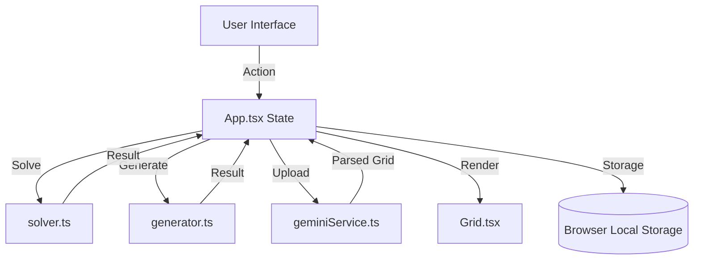

# 🛠️ Code Documentation

Welcome to the technical deep dive of **Tango Master**. This document outlines the architecture, code structure, and core logic of the application.

## 📂 File Structure

| Path | Description |
| :--- | :--- |
| `App.tsx` | The **Main Entry Point**. Manages global state (grid, history, constraints) and coordinates between components. |
| `index.tsx` | React bootstrapper. |
| `types.ts` | Centralized TypeScript interfaces and enums for the puzzle domain. |
| `components/Grid.tsx` | Renders the 6x6 puzzle board and interactive constraints. |
| `components/HistoryModal.tsx` | UI for viewing and managing solved board history. |
| `components/GeneratorModal.tsx` | UI for selecting difficulty and generating new boards. |
| `services/solver.ts` | The core backtracking algorithm that solves the puzzle. |
| `services/generator.ts` | Logic for procedurally generating valid, solvable puzzles. |
| `services/geminiService.ts` | Integration with Google Gemini for screenshot analysis. |

---

## 🏗️ Architecture Overview

The application follows a **Functional Component Architecture** using React. State is managed locally at the top level (`App.tsx`) and passed down via props, ensuring a "single source of truth" for the puzzle grid.

### 🔄 Data Flow

---

## 🧠 Core Methods & Logic

### 1. Backtracking Solver (`solver.ts`)
The `solve` function uses a recursive backtracking approach:
- **Optimization**: It checks constraints (equal/opposite/count) at every step to prune the search tree.
- **Constraints Handled**: 
    - No more than 3 of the same type in a row/column.
    - Equal number of Suns and Moons (3 each) per row/column.
    - Relationship constraints (=, x) between adjacent cells.

### 2. Procedural Generator (`generator.ts`)
1. Generates a full valid board using the solver.
2. Randomly removes cells and constraints based on the chosen difficulty level:
    - **Easy**: ~55% cells remaining.
    - **Medium**: ~40% cells remaining.
    - **Hard**: ~25% cells remaining.

---

## 📦 Dependencies

- **Framework**: `React 19`
- **Build Tool**: `Vite 6`
- **UI Icons**: `Lucide React`
- **AI**: `@google/genai` (Gemini 1.5/2.0+ support)
- **Styling**: `Tailwind CSS`

---

## 🌐 API & External Integrations

### Google Gemini AI
- **Model**: `gemini-1.5-flash` (or newer)
- **Purpose**: Parses image screenshots to detect the initial state of a 6x6 grid.
- **Security**: Requires an API Key provided via `.env.local` (client-side environment variable).
